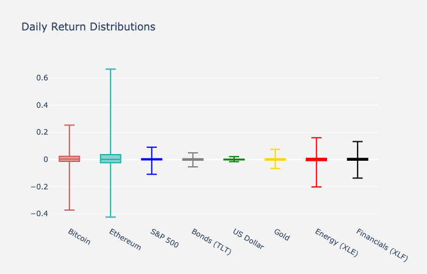
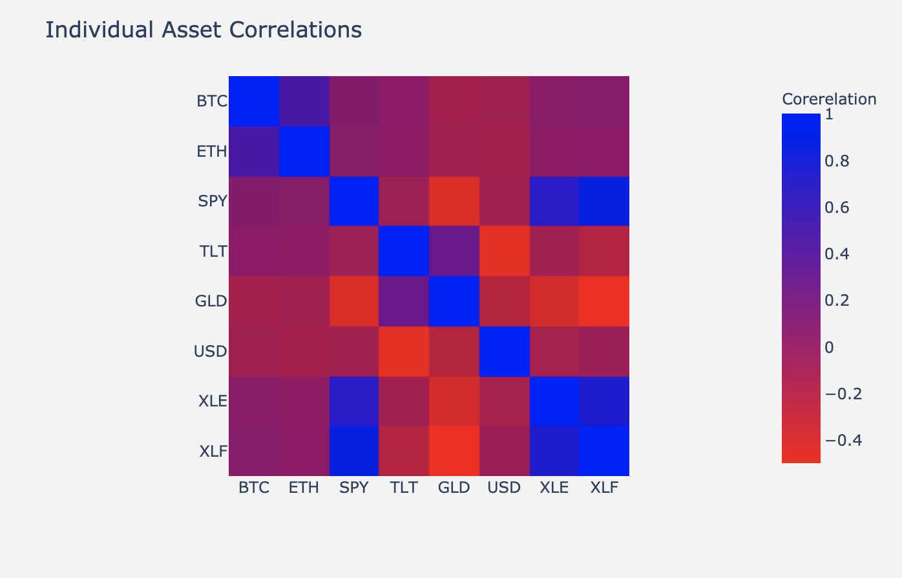
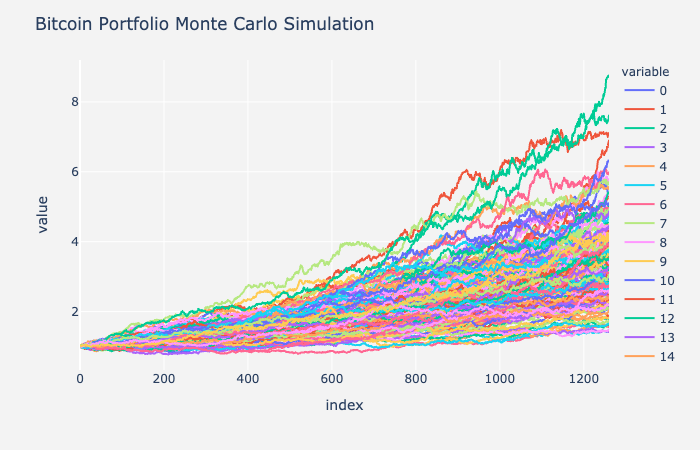

# Project Alpha - Cryptocurrency and the traditional world of finance
##### by Andre Bacellar, Michael Bowey, Lucas Shaiman, and Sebastian Escobar
---

## Intro 
In this project we set out to explore the future of cryptocurrency as well as its formal applications as they integrate into traditional financial portfolios. 

Currently, most traditional portfolios consist of a simple balance of 60% Equity and 40% Bonds so we based our traditional portfolio example off this.

We wanted to play with these balances and find out if or how cryptocurrencies can be integrated into this equation, as well as answer a few questions we had along the way.

## Are cryptocurrencies an attractive asset class?
 * We analyzed the sharpe ratios of a few asset classes we pulled from Yahoo Finance
    1. Bitcoin
    2. Ethereum
    3. S&P 500
    4. Long Term Treasury Bonds (TLT)
    5. Gold
    6. United States Dollar
    7. Energy Sector ETF (XLE)
    8. Financial Sector ETF (XLF)
 * From the data - we saw that cryptocurrencies Bitcoin and Ethereum produced the highest sharpe ratios. They both doubled the S&P 500 above 1.5+

## What are the risks?
* All investing comes with risk and the only way institutional banks will adopt and integrate cryptocurrencies into their clients porfolios is if they can mitigate that risk similar to what is currently available.
* We analyzed 5 Years of historical data; however in order to properly analyze risk we would need much more.
* Based on that data available - we measured the volitility of each asset as well as the correlation between those assets.

* You can see there aren't any distinct correlations between the cryptocurrencies and the other assets we have evaluated. This can further diversify a portfolio and reduce risk. 

## Can you integrate it into a traditional 60/40 financial portfolio?
* Using our 5 Years of historical data we started with a traditional balanced portfolio that included 50% Equity, 40% LT Bonds, 5% Gold and 5% Cash 
* We then substituted the combined 10% of Gold and Cash for 10% of Bitcoin and then again 10% of Ethereum
* The Bitcoin Portfolio conisted of 50% Equity, 40% LT Bonds, 10% Bitcoin
* The Ethereum Portfolio consisted of 50% Equity, 40% LT Bonds, 10% Ethereum

## What are the optimal weight allocations?
* The next step was to select the best weight allocation each asset class. 
* We turned to the Harry Markowitz Modern Portfolio Theory - which is a mathmatical framework that will maximize the returns of assets given a level of risk. 
* The Alpha Portfolio consisted of 27% Equity, 20% LT Bonds, 24% Gold, 15% Cash, 7% Bitcoin, 8% Ethereum (note - ratio's are rounded and don't equal 100%)

## What would our returns look like in 5 years if we included crypto?
* We then ran several Monte Carlo Simulations to forcast future returns 5 years into the future. 

* There is a 95% chance that an initial investment of $1000 in the portfolio over the next 5 years will end within in the range of $2036.45 and $5816.50

* There is a 95% chance that an initial investment of $1000 in the portfolio over the next 5 years will end within in the range of $2548.9 and $9861.21

* There is a 95% chance that an initial investment of $1000 in the portfolio over the next 5 years will end within in the range of $2907.57 and $8184.87

## What happens when Crypto keeps growing? When should you re-balance your portfolio? Is there a way to automate this process?

* Lastly, we wanted to brainstorm a way investors can keep tabs on their portfolio. 
* Since cryptocurrencies are notoriously volatile, it can be easy to have your portfolio fall out of it's optimal balance. 
* We generated a way to monitor this using Twilio's rest API that will send you an SMS telling you to BUY, SELL or HOLD for each asset class . (See Twilio_Demo)

