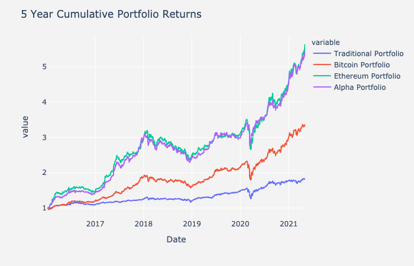
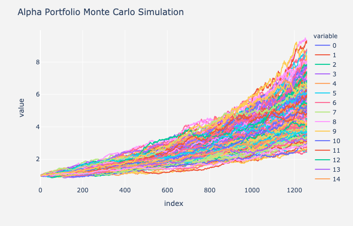

# Project Alpha - Cryptocurrency and the traditional world of finance
##### by Andre Bacellar, Michael Bowey, Lucas Shaiman, and Sebastian Escobar
---

## Intro 
In this project we set out to explore the future of cryptocurrency as well as its formal applications as they integrate into traditional financial portfolios. 

Currently, most traditional portfolios consist of a simple balance of 60% Equity and 40% Bonds so we based our traditional portfolio example off this.

We wanted to play with these balances and find out if or how cryptocurrencies can be integrated into this equation, as well as answer a few questions we had along the way.

## Are cryptocurrencies an attractive asset class?
 * We analyzed the sharpe ratios of a few asset classes we pulled from Yahoo Finance
    1. Bitcoin
    2. Ethereum
    3. S&P 500
    4. 10-year Treasury Bonds
    5. Gold
    6. United States Dollar
    7. Energy Sector Fund
    8. Financial Sector Fund
 * From the data - we saw that cryptocurrencies Bitcoin and Ethereum produced the highest sharpe ratios. They both doubled the S&P 500 above 1.5+

## What are the risks?
* All investing comes with risk and the only way institutional banks will adopt and integrate cryptocurrencies into their clients porfolios is if they can mitigate that risk similar to what is currently available.
* We analyzed 5 Years of historical data however in order to property analyze risk we would need much more.
* Based on that data we measured the volitility of each asset as well as the correlation between those assets.

* You can see there aren't any distinct correlations between the cryptocurrencies and the other assets we have evaluated. This can further diversify a portfolio and reduce risk. 

## Can you integrate it into a traditional 60/40 financial portfolio?
* Using our 5 Years of historical data we swapped out traditional assets such as Gold and Cash (USD) with 10% cryptocurrency.
* The Etherium portfolio has 10% ETH swapped out instead of Cash and Gold as well as the Bitcoin portfolio, only with 10% BTC. 

* As you can see there is what we call an Alpha Portfolio which uses a different weight allocation.

## What are the optimal weight allocations?
* In order to figure out what the best weight allocation was for the assets we selected. We turned to the Harry Markowitz Modern Portfolio Theory - which is a mathmatical framework that will maximize the returns of assets given a level of risk. 

* We then ran several Monte Carlo Simulations to forcast future returns 5 years into the future. 

## What happens when Crypto keeps growing? When should you re-balance your portfolio? Is there a way to automate this process?

* Lastly, we wanted to brainstorm a way investors can keep tabs on their portfolio. 
* Since cryptocurrencies are notoriously volitile, it can be easy to have your portfolio fall out of it's optimal balance. 
* We generated a way to montitor this using Twilio's rest API that will text you what your assets current price is as well as what to Buy, Hold, or Sell, periodically. (See Twilio_Demo)