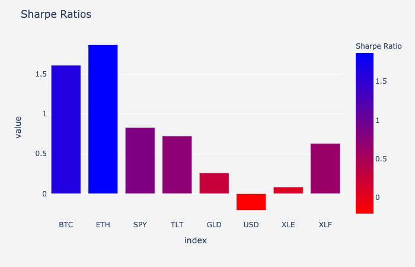
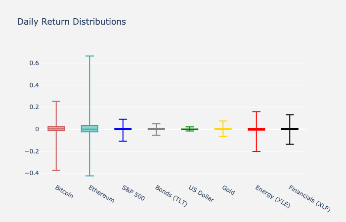
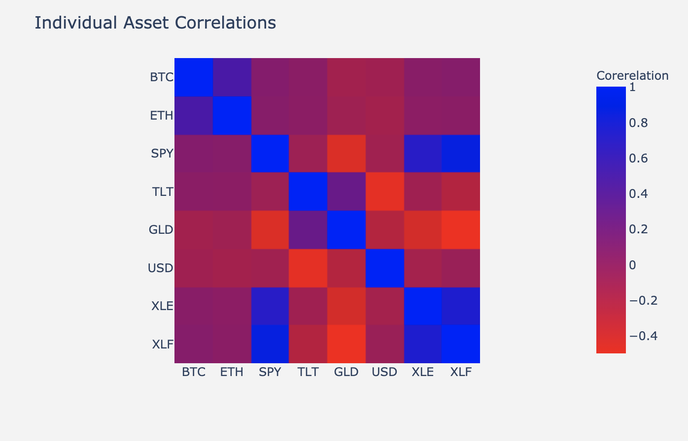
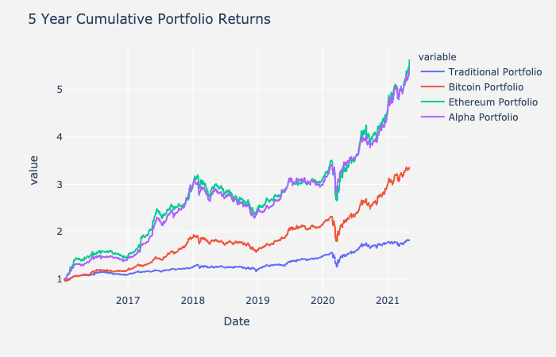
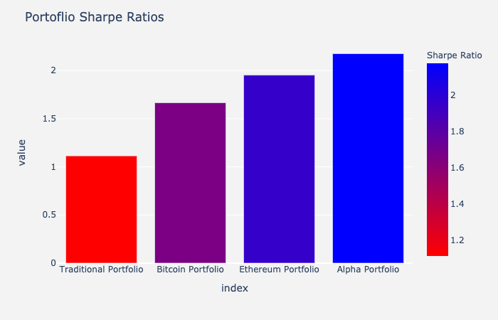
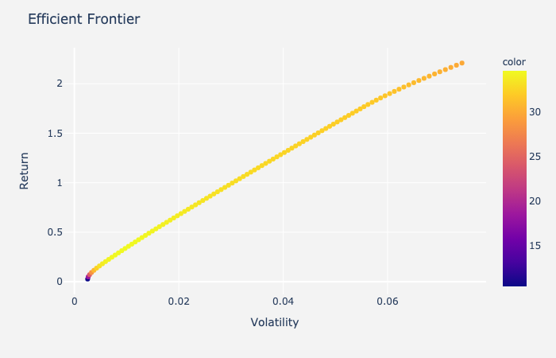
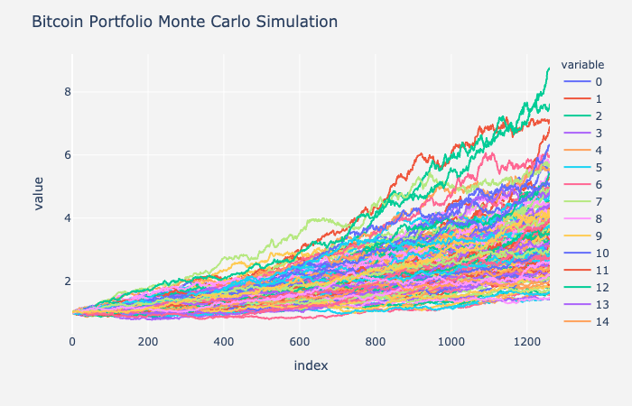
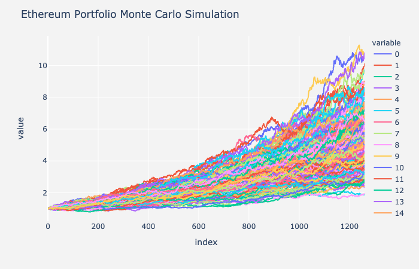
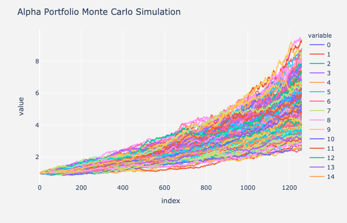

project_alpha_readme

# Cryptocurrency and the traditional world of finance
##### by Andre Bacellar, Malaika Oglesby, Michael Bowey, Lucas Shaiman, and Sebastian Escobar

---
### Are Cryptocurrencies an attractive Asset Class?

### What are the risks?

### Can you integrate it into a traditional 60/40 financial portfolio?

### What are the optimal weight allocations?

### What happens when Crypto keeps growing? When should you re-balance your portfolio? Is there a way to automate this process?

> Twilio
